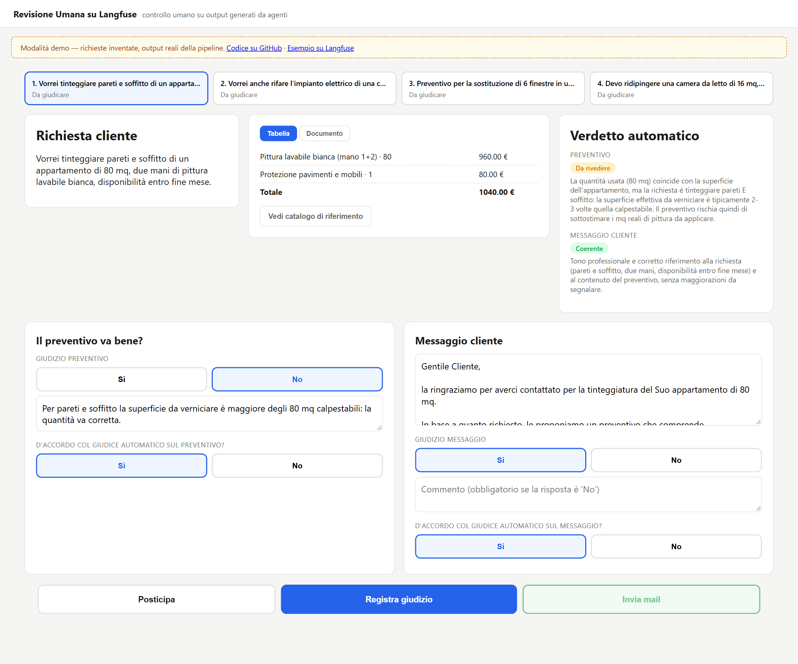

# Revisione Umana su Langfuse

Interfaccia web con cui un revisore senza formazione tecnica giudica gli output di un agente (qui preventivi e messaggi ai clienti) prima che escano dall'azienda, con i giudizi salvati come punteggi su Langfuse accanto a quelli del giudice automatico che ha già valutato gli stessi output, così che un ingegnere AI possa confrontarli.

**Demo online:** https://revisione-umana-langfuse-demo.vercel.app — quattro output reali della pipeline su richieste inventate; i giudizi non vengono salvati da nessuna parte.



## Installare, eseguire, testare

Provare l'interfaccia in locale con gli stessi dati, senza Langfuse:

```bash
cd frontend
npm install
npm run dev        # http://localhost:3000
```

Collegarla a un progetto Langfuse (serve `claude`, la CLI di Claude Code, con login attivo):

```bash
cp .env.example .env      # inserire LANGFUSE_HOST, LANGFUSE_PUBLIC_KEY, LANGFUSE_SECRET_KEY
cd backend
python -m venv .venv && .venv/Scripts/activate      # .venv/bin/activate su macOS e Linux
pip install -r requirements.txt
python run_pipeline.py 2026-09-29     # elabora le 10 richieste di backend/data/richieste.json
cd ../frontend && npm run dev
```

Test: `cd backend && pytest` (42 test) e `cd frontend && npm test` (22 test) più `npm run typecheck`. Passano da un clone pulito, senza credenziali, perché il client di Claude e quello di Langfuse sono simulati. Non c'è una suite di valutazione dell'accuratezza del giudice automatico: la prova più vicina è quella su 10 richieste descritta sotto.

## Che cosa fa

Il problema è che chi controlla in azienda l'output di un'automazione spesso non l'ha costruita e non conosce tracce, punteggi e configurazioni, mentre chi la mantiene (l'ingegnere AI) ha bisogno proprio dei giudizi di quella persona per capire dove l'agente sbaglia. L'interfaccia è pensata per un addetto commerciale o amministrativo.

- **Entrano**: una richiesta cliente in testo libero, un catalogo di voci e prezzi (`backend/data/catalogo.json`) e il profilo dell'azienda per l'intestazione del PDF, tutti in file JSON sostituibili senza toccare il codice.
- **Escono**: per ogni richiesta un preventivo (voci, quantità, prezzi, totale), un messaggio al cliente, un PDF del preventivo, due verdetti automatici (uno sul preventivo, uno sul messaggio) e, dopo la revisione, quattro punteggi umani su Langfuse. Se il revisore modifica il messaggio, il testo corretto è salvato nei metadati del punteggio `verdetto_messaggio`.

```
richiesta → esecutore → giudice automatico → coda Langfuse → revisore (questa interfaccia) → punteggi su Langfuse
```

Il revisore dà, per il preventivo e per il messaggio, un esito (`verdetto_preventivo`, `verdetto_messaggio`: sì, no o da rivedere, con commento) e l'accordo con il giudice automatico (`accordo_preventivo`, `accordo_messaggio`: sì o no). Con quattro punteggi separati si distingue se ha sbagliato l'esecutore o il giudice automatico senza dedurlo da un commento libero.

Stack: esecutore e giudice automatico usano Claude Sonnet tramite `claude -p --model sonnet` (abbonamento, non chiave API; l'alias non fissa la versione e le tracce non la registrano); Langfuse Cloud con l'SDK Python 4.15.2; PDF con reportlab 5.0.1; interfaccia in Next.js 16 e React 19 adattata dal template [`custom-annotation-ui`](https://github.com/langfuse/langfuse-examples/tree/main/applications/custom-annotation-ui); test con pytest e Vitest.

## Che cosa ha mostrato la prova

Un solo lancio (lotto `2026-09-29`) su 10 richieste scritte a mano (tinteggiatura, sostituzione di finestre, pulizia di fine cantiere), alcune con un caso limite: un servizio non a catalogo, un servizio da escludere su richiesta del cliente, pareti già in buono stato.

- Il giudice automatico ha dato "sì" al preventivo in 8 richieste su 10 e "da rivedere" in 2 (una camera di 16 mq con una pulizia di cantiere da 144 € non richiesta; un appartamento di 80 mq dove la quantità di pittura coincide con la superficie del pavimento, non con pareti e soffitto). Al messaggio ha dato "sì" in 10 su 10.
- Sono state giudicate da un revisore 6 richieste, tutte tra quelle a cui il giudice aveva dato "sì" su entrambe le dimensioni; le due segnalate dal giudice sono ancora in coda. Il revisore concorda con il giudice in 5 richieste su 6 e dissente in una (cucina con impianto elettrico non a catalogo: preventivo con stuccatura e pulizia non richieste, messaggio senza totale, poi corretto). Questi giudizi li ha inseriti l'autore con l'aiuto di Claude per popolare Langfuse, quindi non misurano l'accordo di un revisore indipendente, e 6 casi non bastano per una percentuale.
- Nel primo lancio il giudice segnalava errori di codifica ("€" al posto di "€") in 7 messaggi su 10. Il difetto era nella pipeline: `subprocess.run(text=True)` su Windows decodificava in cp1252 l'output UTF-8 di Claude, e il giudice valutava correttamente un testo rovinato. Con `encoding="utf-8"` le segnalazioni sono 0 su 10. I test non lo vedevano perché simulano il client di Claude.

## Dove sono i file

| Cosa | Dove |
|---|---|
| Esecutore, giudice automatico, prompt | `backend/giudice_pipeline/esecutore.py`, `giudice_automatico.py` |
| Chiamata a Claude Code, scrittura su Langfuse, PDF | `claude_cli.py`, `langfuse_gateway.py`, `documento.py` |
| Lettura della coda e scrittura dei punteggi umani | `frontend/lib/langfuse.ts`, `frontend/lib/azioni.ts` |
| Schermata di revisione | `frontend/components/ItemDaRivedereView.tsx` |
| Modalità demo | `frontend/lib/demo.ts`, `frontend/app/page.tsx` |
| Glossario e decisioni | `CONTEXT.md` |

## Decisioni

- **Layout scelto dopo un prototipo usa e getta**: tre varianti con dati finti (schede sovrapposte per telefono, annotazione riga per riga, tre colonne di sola lettura con area di lavoro sotto). Vince la terza perché il revisore userebbe lo strumento più volte al giorno da postazione fissa, e separare "cosa guardo" da "cosa faccio" regge meglio con quattro campi di giudizio e un testo modificabile.
- **Interfaccia neutra, personalizzazione solo sul contenuto in uscita**: colori e pulsanti sono uguali per ogni azienda, mentre il PDF e il messaggio portano nome e dati dell'azienda (qui un'azienda finta, ACME).
- **Scrittura dei punteggi idempotente**: `Promise.allSettled` con id `{idTraccia}-{nome}`, perché un retry dopo un fallimento parziale duplicava i punteggi già scritti (trovato in una revisione del codice con 8 agenti in parallelo).
- **Claude Code non interattivo invece di una API a consumo**, a costo di dover vincolare l'output nel prompt invece di ricevere JSON garantito; con `--safe-mode`, perché senza il modello scopriva il `CLAUDE.md` del repository e usciva dal ruolo.

## Limiti

La ricalibrazione del giudice automatico non è implementata: il progetto raccoglie i giudizi umani sulla stessa traccia, che è il dato di cui ogni metodo ha bisogno, ma non ne applica nessuno, perché non esiste un metodo riconosciuto da tutti (modifica manuale del prompt, fine-tuning, calibrazione statistica). Non ci sono login, invio reale delle email né una versione pubblicata. Rilanciare `run_pipeline.py` senza indicare un lotto riusa gli id delle tracce e aggiunge osservazioni e punteggi doppi. Il catalogo di prova ha 8 voci, e l'esecutore compone i preventivi solo con quelle.

## Licenza

MIT, vedi [`LICENSE`](LICENSE).
